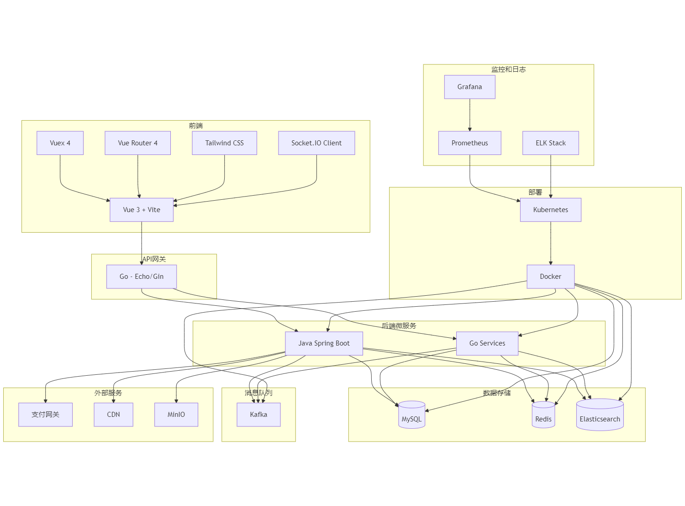

# B2B2C商城-后端技术实施方案

## 1. 系统架构概览

### 1.1 整体架构
- 前端: Nginx (静态资源服务器 + 反向代理 + 负载均衡)
- API网关: Go
- 微服务: 主要使用Java Spring Boot，部分高性能服务使用Go
- 消息队列: Kafka
- 数据库: MySQL (主数据存储), Redis (缓存), ShardingSphere(数据库中间件), PostgreSQL(归档数据存储：日志、订单)
- 搜索引擎: Elasticsearch
- 容器化: Docker, Kubernetes
- 推流服务：Nginx-RTMP

### 1.2 架构图

## 2. 技术栈详细说明

### 2.1 API网关 (Go)
- 框架: Echo或Gin
- 功能:
  - 请求路由
  - 认证授权 (JWT)
  - 限流
  - 日志记录
  - 服务发现集成

### 2.2 微服务 (Java Spring Boot + Go)
- Java部分:
  - Spring Boot 2.x
  - Spring Cloud (服务发现、配置管理)
  - Spring Security (安全框架)
  - Hibernate/JPA (ORM)
- Go部分:
  - 框架: Gin或Echo
  - ORM: GORM

### 2.3 消息队列 (Kafka)
- 版本: 最新稳定版
- 用途:
  - 异步处理
  - 系统解耦
  - 削峰填谷

### 2.4 数据库
- MySQL:
  - 版本: 8.x
  - 分库分表策略: ShardingSphere
- Redis:
  - 版本: 6.x
  - 用途: 缓存、会话存储、限流
- PostgreSQL:
  - 版本: 13.x
  - 用途: 归档数据存储 (如日志、订单)
- ShardingSphere:
  - 版本: 5.x
  - 用途: 分库分表分片的数据库中间件

### 2.5 搜索引擎 (Elasticsearch)
- 版本: 7.x
- 用途: 商品搜索、日志分析

### 2.6 容器化和编排
- Docker
- Kubernetes (用于生产环境)

## 3. 核心功能实现

### 3.1 用户认证与授权
- 实现基于JWT的认证系统
- 集成OAuth2.0用于第三方登录
- 实现RBAC权限模型

### 3.2 商品管理
- 实现商品CRUD API
- 集成Elasticsearch用于商品搜索
- 实现商品分类、属性管理

### 3.3 订单系统
- 设计高并发订单创建流程
- 实现订单状态管理
- 集成支付网关

### 3.4 库存管理
- 实现实时库存更新
- 设计库存锁定机制防止超卖

### 3.5 直播和拍卖系统
- 使用WebSocket实现实时通信
- 设计高并发竞价系统
- 实现直播状态管理

### 3.6 商家管理
- 实现商家入驻、审核流程
- 设计商家数据隔离方案
- 实现商家结算系统

## 4. 数据库设计

### 4.1 主要数据表
- 用户表
- 商品表
- 订单表
- 库存表
- 商家表
- 直播表
- 拍卖表

### 4.2 分库分表策略
- 按用户ID做分库
- 按时间范围做分表 (如订单表)

## 5. API设计

### 5.1 RESTful API
- 遵循RESTful设计原则
- 使用JSON作为数据交换格式
- 实现版本控制 (如 /api/v1/)

### 5.2 GraphQL API
- 为复杂的数据查询提供GraphQL接口
- 实现数据加载优化 (DataLoader)

### 5.3 实时通信 API
- 使用WebSocket进行实时通信
- 设计消息格式和协议

## 6. 安全策略

### 6.1 数据安全
- 实现敏感数据加密存储
- 使用HTTPS进行数据传输
- 实现数据访问审计日志

### 6.2 应用安全
- 实现输入验证和消毒
- 防御XSS、CSRF、SQL注入等常见攻击
- 实现频率限制和黑名单机制

## 7. 性能优化

### 7.1 缓存策略
- 多级缓存: 本地缓存 + Redis
- 实现缓存预热和更新机制

### 7.2 数据库优化
- 索引优化
- 慢查询分析和优化
- 读写分离

### 7.3 代码级优化
- 使用线程池管理并发
- 异步处理非关键路径操作

## 8. 监控和日志

### 8.1 系统监控
- 使用Prometheus + Grafana构建监控系统
- 设置关键指标的告警阈值

### 8.2 日志管理
- 使用ELK栈进行日志收集和分析
- 实现分布式追踪 (如使用Jaeger)

## 9. 部署和运维

### 9.1 CI/CD
- 使用Jenkins或GitLab CI构建CI/CD流程
- 实现自动化测试和部署

### 9.2 容器编排
- 使用Kubernetes进行容器编排
- 实现自动扩缩容

### 9.3 数据备份和恢复
- 设计定期备份策略
- 实现数据恢复演练

## 10. 扩展性考虑

### 10.1 服务拆分策略
- 按业务领域进行服务拆分
- 设计服务间通信协议 (考虑使用gRPC)

## 12. 风险评估和应对策略

1. 技术风险: 新技术学习曲线
   - 应对: 提前进行技术培训和原型验证
2. 性能风险: 高并发场景下的系统稳定性
   - 应对: 进行全面的压力测试，并制定应急方案
3. 安全风险: 数据泄露和系统入侵
   - 应对: 实施严格的安全审计和定期渗透测试
4. 进度风险: 项目延期
   - 应对: 合理规划，设置缓冲时间，及时调整优先级

## 13. 总结

本技术实施方案为B2B2C商城后端系统提供了全面的技术路线图。通过采用微服务架构、容器化技术和现代化的开发流程，旨在构建一个高性能、可扩展且易于维护的系统。在实施过程中，我们将持续关注性能优化、安全加固和用户体验提升，确保系统能够满足业务增长的需求。
